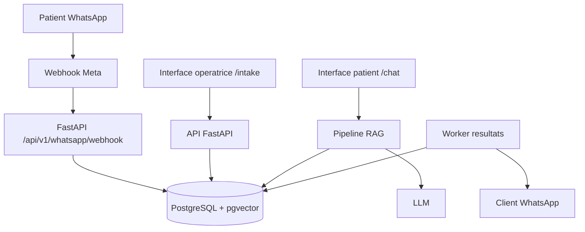

# Lab AI Chat

Prototype PFF pour un laboratoire d'analyses medicales : gestion des demandes WhatsApp, assistant IA pour les patients, et automatisation encadree de la livraison des resultats.

## Resume du projet

Le projet repond a trois besoins metier concrets du laboratoire :

- centraliser les demandes patients venant de WhatsApp
- assister l'operatrice dans le traitement des ordonnances et le suivi du workflow
- repondre automatiquement aux questions frequentes et preparer l'envoi des resultats

Le depot est organise comme un monorepo :

- `frontend-pff-lab/` : interface web React + TypeScript
- `fastapi_app/` : API FastAPI, logique metier, RAG et integrations
- `docs/` : guides techniques et documentation complementaire

## Modules fonctionnels

### 1. Intake WhatsApp pour l'operatrice

- ingestion des messages WhatsApp via webhook Meta
- creation et suivi des conversations patients
- affichage du fil de messages, des ordonnances detectees et des actions operateur
- envoi de messages sortants depuis l'interface

### 2. Chatbot IA pour le patient

- reponses automatisees aux questions frequentes
- pipeline RAG base sur PostgreSQL + pgvector
- garde-fous metier pour eviter les reponses de type diagnostic medical

### 3. Livraison assistee des resultats

- validation humaine avant envoi
- worker de traitement automatique avec journalisation
- prise en charge de l'envoi WhatsApp et des etats de livraison

## Architecture



## Stack technique

- Frontend : React 19, TypeScript, TanStack Router, Tailwind CSS
- Backend : FastAPI, SQLAlchemy async, Alembic
- Base de donnees : PostgreSQL 16 + pgvector
- IA : embeddings Sentence Transformers, pipeline RAG, LLM externe
- Automatisation : APScheduler, webhooks WhatsApp Meta
- Qualite : GitHub Actions, tests backend/frontend, verification Docker

## Lancement local avec Docker

### Prerequis

- Docker Desktop lance
- un fichier `.env` local a la racine

### Demarrage

Premier lancement ou apres changement de dependances :

```bash
docker compose up -d --build
```

Redemarrage normal pendant le developpement :

```bash
docker compose up -d
```

### URLs locales

- Frontend : `http://localhost:3000`
- Backend : `http://localhost:8000`
- Documentation API : `http://localhost:8000/docs`

### Comptes de demonstration

- `admin@lab.local` / `Admin123!`
- comptes seed supplementaires disponibles via les scripts backend

### Workflow de developpement conserve

Le developpement local reste base sur Docker avec live reload :

- le backend est monte en bind mount et tourne avec `uvicorn --reload`
- le frontend est monte en bind mount et garde le HMR de Vite
- les commandes quotidiennes restent `docker compose up -d` et `docker compose logs -f`

Autrement dit, l'integration GitHub ne remplace pas votre workflow local : elle ajoute seulement la validation CI sur les pushes.

## Demonstration jury

Pour une soutenance de 10 a 15 minutes, le parcours recommande est :

1. montrer une conversation WhatsApp et le bureau operateur sur `/intake`
2. montrer le chatbot patient sur `/chat`
3. montrer la validation puis la livraison d'un resultat

Guide detaille : [pff_demo_script.md](./pff_demo_script.md)

## GitHub Actions

Le depot est prepare pour un usage **CI uniquement** a ce stade :

- verification des dependances sur les pull requests
- lint, tests et controles qualite backend
- lint, typecheck, tests et build frontend
- tests d'integration avec PostgreSQL
- validation des builds Docker

Il n'y a pas encore de deploiement automatique actif, car le projet tourne pour l'instant en local sur Docker Desktop.

## Documentation utile

- [Guide Docker de developpement](./DOCKER_DEV.md)
- [Guide rapide local + CI](./docs/quickstart.md)
- [Documentation technique PFF](./pff_technical_documentation.md)
- [Guide GitHub Actions](./docs/github_actions_guide.md)
- [Guide de deploiement futur](./production_deployment_guide.md)

## Captures recommandees pour le depot

Avant la soutenance finale, ajouter idealement 3 captures d'ecran dans le repo ou dans la presentation :

- vue bureau operateur `/intake`
- vue chatbot `/chat`
- vue validation/envoi des resultats

## Roadmap proche

- ameliorer encore le workflow conversationnel du chatbot
- enrichir la supervision des envois WhatsApp
- renforcer l'UX operateur pour la preparation des demandes
- preparer une future phase de deploiement quand un serveur sera disponible

## Statut du projet

Le projet est actuellement optimise pour :

- le developpement local rapide
- la demonstration PFF
- l'amelioration continue des fonctionnalites avant mise en production
