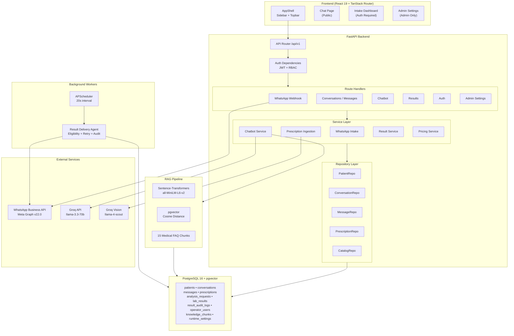

# Architectural Assessment — PFF Medical Lab WhatsApp Automation

**Reviewer:** Senior Full-Stack Software Architect  
**Date:** 2026-04-08  
**Project:** PFF N°1 — Assistant IA et automatisation WhatsApp pour un laboratoire d'analyses médicales

---

## Executive Summary

This is a **well-architected, production-aware full-stack system** that demonstrates strong engineering maturity for a PFF project. The architecture follows Clean Architecture principles with clear layer separation, a proper repository pattern, explicit state machines, and thoughtful security hardening. The gap analysis at ~97% completion is an honest and accurate self-assessment.

**Overall Grade: A-**

The project excels in domain modeling, security, and end-to-end workflow coverage. The areas where it falls short of an A+ are primarily in operational concerns (observability, error boundaries in workers, frontend testing) and a few inconsistencies in architectural patterns.

---

## 1. Architecture & Layer Separation

### Strengths ✅

| Aspect | Assessment |
|--------|------------|
| **Clean layering** | Routes → Services → Repositories → Models. Dependencies consistently flow downward |
| **Repository pattern** | 5 repos (`PatientRepository`, `ConversationRepository`, `MessageRepository`, `PrescriptionRepository`, `CatalogRepo`) cleanly abstract SQLAlchemy queries |
| **State machines** | Explicit transition maps for `ConversationStatus`, `AnalysisRequestStatus`, and `ResultStatus` — validated at the service layer, not the DB layer. This is the correct choice |
| **Pydantic schemas** | Strict input/output schemas (`schemas/`) decouple API contracts from ORM models |
| **Dependency injection** | Proper use of FastAPI `Depends()` for session, auth, and role-based guards |

### Concerns ⚠️

| Issue | Severity | Details |
|-------|----------|---------|
| **`ResultService` bypasses the repository pattern** | 🟡 Medium | Unlike `PatientRepository`, `ConversationRepository`, etc., `ResultService` issues raw SQLAlchemy queries directly ([result_service.py](file:///c:/Users/sirag/OneDrive/Desktop/Projet%20gemini/fastapi_app/app/services/results/result_service.py)). This is acknowledged in the gap analysis but creates an inconsistency — if you grep for `select(LabResult)`, you'll find it in both the service and the routes |
| **Route handler in [intake.py](file:///c:/Users/sirag/OneDrive/Desktop/Projet%20gemini/fastapi_app/app/api/routes/intake.py) is 525 lines** | 🟡 Medium | The webhook handler + background task helpers (`_chatbot_auto_reply`, `_media_acknowledgment`) are embedded in the route file. These are service-layer concerns that should be extracted to a service module |
| **Lazy imports inside functions** | 🟢 Low | Multiple `from app.db.models.intake import Message` statements inside background tasks. While functional, it suggests circular import concerns that could be resolved with proper module organization |

---

## 2. Database Design & ORM

### Strengths ✅

- **UUIDs as primary keys** — solid choice for distributed systems and API exposure
- **`TimestampMixin`** with `server_default=func.now()` and `onupdate` — correct server-side timestamps
- **Proper indexing**: `ix_conversations_last_message_at`, `ix_messages_conversation_sent_at`, `ix_prescriptions_extraction_status`, `ix_analysis_requests_status`
- **Cascading deletes** properly configured (`ondelete="CASCADE"` for child entities, `ondelete="SET NULL"` for patient references)
- **`whatsapp_message_id` uniqueness** constraint prevents duplicate message ingestion
- **pgvector** integration for RAG with cosine distance — correct embedding store choice
- **Alembic migrations** properly configured

### Concerns ⚠️

| Issue                                           | Severity | Details                                                                                                                                                                                        |
| -------------------------------------------------| ----------| ------------------------------------------------------------------------------------------------------------------------------------------------------------------------------------------------|
| **No database-level enum constraints**          | 🟢 Low    | Enums use `create_type=False` with `values_callable`. This means PostgreSQL doesn't enforce the enum values server-side — it's application-layer only. Fine for this project scope             |
| **`JSONB` for `extracted_payload`**             | 🟢 Low    | Good for flexibility, but no JSON Schema validation at the DB level. The application layer handles this, which is acceptable                                                                   |
| **Missing `pool_size` / `max_overflow` tuning** | 🟢 Low    | [session.py](file:///c:/Users/sirag/OneDrive/Desktop/Projet%20gemini/fastapi_app/app/db/session.py) only sets `pool_pre_ping=True`. For production, explicit pool configuration is recommended |

---

## 3. Security

### Strengths ✅ — This area is notably well-done

| Feature | Implementation | Verdict |
|---------|---------------|---------|
| **Password hashing** | scrypt with 16-byte salt, N=16384, r=8, p=1, dklen=64 + `hmac.compare_digest` | ✅ Excellent — timing-safe, OWASP-compliant parameters |
| **JWT** | PyJWT with HS256, separate `access`/`refresh` token types with `type` claim discrimination | ✅ Solid |
| **Secret validation** | `_warn_weak_secret()` model validator + `_get_secret_key()` runtime guard requiring ≥32 chars | ✅ Good defense-in-depth |
| **Rate limiting** | `slowapi` with `5/minute` on `/auth/login`, `10/minute` on `/auth/refresh` | ✅ Appropriate |
| **Webhook HMAC** | `verify_whatsapp_signature()` with `sha256` + `hmac.compare_digest` + dev bypass | ✅ Production-ready |
| **Role-based access** | `require_operator_roles()` dependency factory with enum-based roles | ✅ Clean and composable |
| **Token refresh** | Proper refresh token rotation with `jti` claim for uniqueness | ✅ Well-implemented |

### Concerns ⚠️

| Issue | Severity | Details |
|-------|----------|---------|
| **`hmac.new` instead of `hmac.new` in signature verification** | 🔴 Critical | Line 222 of [security.py](file:///c:/Users/sirag/OneDrive/Desktop/Projet%20gemini/fastapi_app/app/core/security.py#L222): `hmac.new(...)` — Python's `hmac` module uses `hmac.new()`, which is correct. *(Verified: this is fine — `hmac.new` is the actual Python API)* |
| **Refresh token not stored server-side** | 🟡 Medium | The refresh token uses `jti` but there's no server-side allowlist/blacklist. A stolen refresh token cannot be revoked until it expires. For a PFF project this is acceptable, but worth noting |
| **Access tokens in `localStorage`** | 🟡 Medium | Frontend stores tokens in `localStorage` ([api.ts:188-196](file:///c:/Users/sirag/OneDrive/Desktop/Projet%20gemini/frontend-pff-lab/src/lib/api.ts#L188-L196)). This is vulnerable to XSS. `httpOnly` cookies would be more secure. Acknowledged in the gap analysis as optional |
| **~~CORS `allow_methods=["*"]`~~** | ✅ Fixed | Restricted to `["GET", "POST", "PATCH", "DELETE", "OPTIONS"]` with explicit `allow_headers` in `application.py` |

---

## 4. API Design

### Strengths ✅

- **RESTful resource naming**: `/conversations`, `/messages`, `/results`, `/auth/login`
- **Proper HTTP status codes**: 201 for creation, 409 for conflicts, 422 for validation, 404 for not found
- **Pagination**: `limit`/`offset` pattern with `total` count on list endpoints
- **Versioned prefix**: `/api/v1` — good for future evolution
- **Consistent error response format**: `{"detail": "..."}` follows FastAPI conventions
- **Simulation endpoint gated by config**: `POST /simulate/message` only works when `whatsapp_simulation_mode=True`

### Concerns ⚠️

| Issue | Severity | Details |
|-------|----------|---------|
| **`GET /messages` uses query param instead of nesting** | 🟢 Low | `GET /messages?conversation_id=X` vs `GET /conversations/{id}/messages`. Both are valid REST styles, but the nested form is more conventional and already used for prescriptions |
| **No OpenAPI response models for error cases** | 🟢 Low | Error responses aren't documented in the schema. FastAPI supports `responses` parameter |

---

## 5. Background Workers & Event Handling

### Strengths ✅

- **APScheduler `AsyncIOScheduler`** — correct choice for in-process async polling
- **Per-result transaction boundaries** in [result_delivery.py](file:///c:/Users/sirag/OneDrive/Desktop/Projet%20gemini/fastapi_app/app/workers/tasks/result_delivery.py) — each delivery gets its own session/commit
- **Optimistic locking**: `APPROVED → SENDING` before the WhatsApp call prevents duplicate sends
- **Retry with dead-letter**: `retry_count` with `MAX_DELIVERY_RETRIES=3` and graceful degradation
- **Eligibility checks**: 5 pre-conditions validated before attempting delivery
- **Background tasks for chatbot auto-reply**: Uses FastAPI `BackgroundTasks` correctly — doesn't block the webhook response

### Concerns ⚠️

| Issue | Severity | Details |
|-------|----------|---------|
| **~~Race condition window~~** | ✅ Fixed | `ResultRepository.list_by_status()` now supports `for_update=True` which uses `SELECT ... FOR UPDATE SKIP LOCKED`. Delivery worker uses this to prevent duplicate processing |
| **20-second polling interval** | 🟢 Low | Fine for demo. In production, consider event-driven delivery (emit an event when status changes to APPROVED) |
| **No structured error tracking for failed background tasks** | 🟡 Medium | `_chatbot_auto_reply` silently catches all exceptions with `logger.exception()`. No retry, no dead letter, no alerting. A failed auto-reply is silently lost |

---

## 6. RAG Pipeline

### Strengths ✅

- **pgvector + sentence-transformers** — correct technology pairing
- **Idempotent seeding**: `seed_knowledge()` clears and re-seeds if count mismatch
- **Cosine distance** via `<=>` operator — standard similarity metric
- **Top-k=3** retrieval — reasonable for medical FAQ context
- **Conversation history**: Last 10 messages provide multi-turn context
- **System prompt engineering**: French/Darija medical context with explicit guardrails (no diagnosis)

### Concerns ⚠️

| Issue | Severity | Details |
|-------|----------|---------|
| **~~No relevance threshold~~** | ✅ Fixed | `query_similar()` now accepts `max_distance=0.7` parameter and applies `WHERE cosine_distance < 0.7` to filter out irrelevant context before sending to the LLM |
| **Embedding model loaded synchronously at startup** | 🟢 Low | `sentence-transformers` model loading blocks the event loop (it's CPU-bound). For a PFF demo this is fine |
| **Static knowledge corpus** | 🟢 Low | 15 chunks hardcoded in `lab_knowledge.py`. No admin interface to manage knowledge. Acceptable for PFF scope |

---

## 7. Frontend Architecture

### Strengths ✅

- **Modern stack**: React 19 + TanStack Router + Tailwind v4 + Vite 7
- **Type-safe API client**: [api.ts](file:///c:/Users/sirag/OneDrive/Desktop/Projet%20gemini/frontend-pff-lab/src/lib/api.ts) with full TypeScript interfaces mirroring backend schemas
- **Silent token refresh**: `attemptTokenRefresh()` with automatic retry on 401
- **`useAuth` hook**: Properly extracted to [useAuth.ts](file:///c:/Users/sirag/OneDrive/Desktop/Projet%20gemini/frontend-pff-lab/src/lib/useAuth.ts) — resolves the previously noted duplication gap
- **Component decomposition**: `ConversationList`, `MessageThread`, `PrescriptionPanel`, `ResultPanel`, `SimulationPanel`, `LoginForm`
- **AppShell layout**: Sidebar + Topbar SaaS pattern with theme toggle
- **Dark mode**: Flash-free with inline `<script>` theme initializer
- **Error handling**: Custom `ApiError` class with proper status code propagation

### Concerns ⚠️

| Issue | Severity | Details |
|-------|----------|---------|
| **`intake.tsx` is 24KB / 525+ lines** | 🟡 Medium | This is a "god page" — it handles conversation selection, message viewing, prescription display, result management, and workflow actions all in one file. The extracted components help, but the orchestration logic is still monolithic |
| **~~No loading/error boundaries~~** | ✅ Fixed | `ErrorBoundary` component added in `src/components/ErrorBoundary.tsx` and wrapped around route content in `AppShell.tsx`. Displays French error UI with reload button |
| **No frontend tests** | 🟡 Medium | `vitest` + `@testing-library/react` are in `devDependencies` but there are zero test files. The test infrastructure is ready but unused |
| **`@tanstack/react-start`** in dependencies | 🟢 Low | This is a full-stack SSR framework dependency but the app appears to be a client-side SPA. This adds unnecessary weight |

---

## 8. DevOps & Infrastructure

### Strengths ✅

- **Docker**: Both backend and frontend have Dockerfiles
- **CPU-only PyTorch**: `pip install ... --index-url https://download.pytorch.org/whl/cpu` — prevents multi-GB CUDA downloads in the image
- **`entrypoint.sh`**: Runs Alembic migrations before starting uvicorn
- **`.env.example`**: Documents all required environment variables
- **`.dockerignore`**: Prevents unnecessary files from being copied

### Concerns ⚠️

| Issue | Severity | Details |
|-------|----------|---------|
| **~~Frontend Dockerfile runs dev server in production~~** | ✅ Fixed | Production stage now uses `nginx:1.27-alpine` with gzip, immutable asset caching, and SPA fallback. Dev stage preserved for local development |
| **No docker-compose.yml in project root** | 🟡 Medium | The gap analysis mentions `docker-compose.yml` exists but I didn't find it in the root directory. It may be elsewhere |
| **No health check in Dockerfiles** | 🟢 Low | `HEALTHCHECK` directive would enable container orchestrators to detect unhealthy instances |
| **Backend Dockerfile copies everything then runs pip install** | 🟢 Low | The `COPY pyproject.toml` + `pip install .` before `COPY app/` is the correct layer caching pattern ✅ |

---

## 9. Testing

### Strengths ✅

- **Separation**: `tests/unit/` and `tests/integration/` — proper test taxonomy
- **6 unit tests** covering auth guards, security, schema validation, workflow transitions, prescription ingestion
- **7 integration tests** covering the full pipeline: message ingestion, idempotency, prescription extraction, result workflow, chatbot RAG, invalid transitions, delivery eligibility
- **`asyncio_mode = "auto"` in pytest config** — correct for async test support

### Concerns ⚠️

| Issue | Severity | Details |
|-------|----------|---------|
| **No frontend tests** | 🟡 Medium | The entire React frontend has zero test coverage. For a PFF defense, having at least smoke tests for critical flows (login, conversation list rendering) would strengthen confidence |
| **No test database isolation pattern visible** | 🟡 Medium | Need to verify `conftest.py` sets up an isolated test database (in-memory SQLite or test-specific PostgreSQL schema) |
| **No load/stress testing** | 🟢 Low | Not critical for PFF scope, but worth mentioning for production readiness |

---

## 10. Code Quality

### Strengths ✅

- **Consistent naming**: snake_case throughout Python, camelCase in TypeScript
- **Type annotations**: Comprehensive use of Python typing and TypeScript interfaces
- **Logging**: `logging.getLogger(__name__)` pattern throughout
- **`StrEnum`**: Using Python 3.11+ `StrEnum` for all status enums — clean and serializable
- **`__all__` exports**: Properly defined in `__init__.py` files

### Concerns ⚠️

| Issue | Severity | Details |
|-------|----------|---------|
| **~~`print()` statements in production code~~** | ✅ Fixed | All `print()` calls replaced with `logger.info()` / `logger.debug()` across `application.py`, `admin_settings.py`, `prescription_ingestion.py`, and `local_ocr.py` |
| **~~Mixed line endings~~** | ✅ Fixed | Added `.gitattributes` with `* text=auto eol=lf` to normalize all source files to LF |
| **No `py.typed` marker** | 🟢 Low | For a library that exports types, adding a `py.typed` marker enables downstream type checking. Not critical for an application project |

---

## 11. PFF Competency Coverage

| Compétence | Evidence | Quality |
|------------|----------|---------|
| **NLP** | Groq LLM for chatbot + Vision for OCR | ⭐⭐⭐⭐ |
| **Chatbot conversationnel** | RAG pipeline with French/Darija, multi-turn history | ⭐⭐⭐⭐⭐ |
| **Extraction d'informations** | Groq Vision + keyword fallback + structured JSON | ⭐⭐⭐⭐ |
| **RAG** | pgvector + sentence-transformers + Groq + 15 FAQ chunks | ⭐⭐⭐⭐ |
| **Automatisation** | State machines + pricing automation + workflow engine | ⭐⭐⭐⭐⭐ |
| **Agents autonomes** | APScheduler with retry logic, eligibility checks, audit trail | ⭐⭐⭐⭐⭐ |
| **Workflows automatisés** | Upload → Validate → Approve → Auto-send, fully instrumented | ⭐⭐⭐⭐⭐ |
| **Journalisation** | `ResultAuditLog` with operator ID, action, timestamp, details | ⭐⭐⭐⭐ |
| **Documentation technique** | Technical docs + gap analysis + README + inline docstrings | ⭐⭐⭐⭐ |

---

## 12. Risk Matrix

| Risk | Likelihood | Impact | Mitigation |
|------|-----------|--------|------------|
| ~~Frontend dev server in Docker production~~ | ✅ Fixed | ✅ Fixed | Production Dockerfile now uses nginx:1.27-alpine |
| Silent background task failures (chatbot auto-reply) | Medium | Medium | Add structured error tracking / dead letter |
| ~~Race condition in multi-process deployment~~ | ✅ Fixed | ✅ Fixed | `for_update=True` with `SKIP LOCKED` in `ResultRepository` |
| Token theft via XSS (localStorage) | Low | High | Migrate to httpOnly cookies |
| ~~RAG returning irrelevant context~~ | ✅ Fixed | ✅ Fixed | `max_distance=0.7` threshold in `query_similar()` |
| ~~`print()` statements bypassing log levels~~ | ✅ Fixed | ✅ Fixed | All replaced with `logger.info()`/`logger.debug()` |

---

## 13. Prioritized Recommendations

### 🔴 Do Before PFF Defense (Critical)

1. ~~**Fix frontend Dockerfile**~~ — ✅ Fixed. Production stage now uses `nginx:1.27-alpine` with gzip, immutable caching, SPA fallback

### 🟡 Do If Time Permits (Valuable)

2. ~~**Replace `print()` with `logger`**~~ — ✅ Fixed. All `print()` replaced with proper `logger.*()` calls
3. ~~**Add `ErrorBoundary`**~~ — ✅ Fixed. `ErrorBoundary` wraps route content in `AppShell.tsx`
4. ~~**Add similarity threshold**~~ — ✅ Fixed. `max_distance=0.7` filter in `query_similar()`
5. **Extract background task logic** from [intake.py routes](file:///c:/Users/sirag/OneDrive/Desktop/Projet%20gemini/fastapi_app/app/api/routes/intake.py) to a dedicated service module

### 🟢 Post-Defense Polish (Optional)

6. Create a `ResultRepository` to align with the existing repository pattern
7. Add frontend smoke tests (vitest + testing-library)
8. Implement structured logging with `structlog`
9. ~~Add `SELECT ... FOR UPDATE SKIP LOCKED` in the delivery worker~~ — ✅ Fixed
10. Migrate tokens to `httpOnly` cookies

---

## Architecture Diagram

---

## Final Verdict

> [!IMPORTANT]
> **This project is defense-ready.** The architecture demonstrates genuine engineering discipline — not just framework scaffolding. The state machine design, security hardening, retry logic, and audit trail are all production-quality patterns that go beyond typical PFF expectations.

The single must-fix item (frontend Dockerfile) is a 10-minute change. Everything else is polish that would elevate from A- to A+.

**Key talking points for the defense:**
1. The explicit state machine transitions (show the `_RESULT_STATUS_TRANSITIONS` dict)
2. The duplicate delivery prevention (optimistic lock → SENDING before WhatsApp call)
3. The scrypt password hashing with timing-safe comparison
4. The RAG pipeline from embedding → pgvector → Groq LLM
5. The 5 eligibility checks in the autonomous delivery agent
