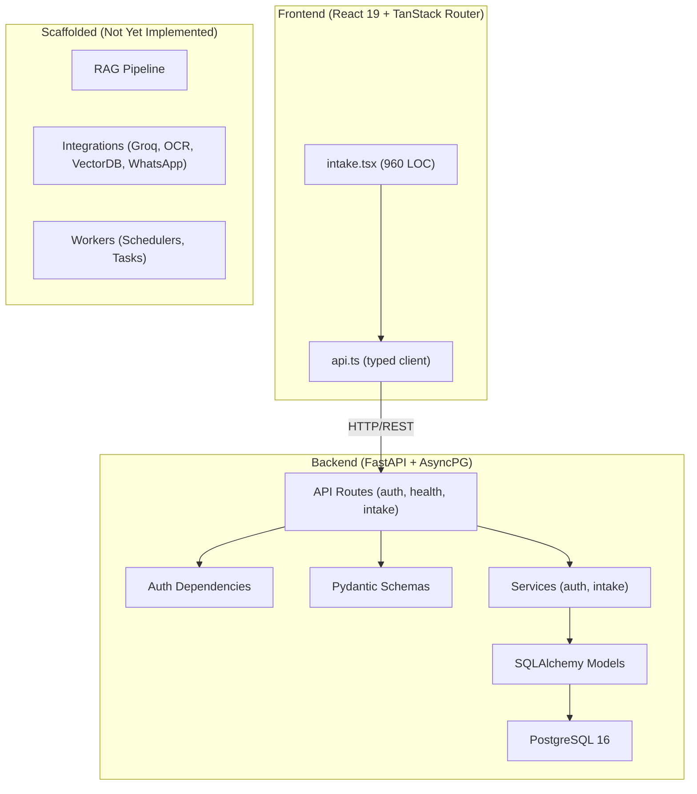

# Architecture Review — PFF Lab (Medical Lab Automation)

**Reviewer perspective:** Senior Full-Stack Software Architect
**Date:** 2026-03-26
**Scope:** Full codebase — [fastapi_app](file:///c:/Users/sirag/OneDrive/Desktop/Project/fastapi_app) (backend) + [frontend-pff-lab](file:///c:/Users/sirag/OneDrive/Desktop/Project/frontend-pff-lab) (frontend)

---

## Executive Summary

This is a **well-structured early-stage project** for a medical laboratory WhatsApp automation system. The foundations are solid — clean layered architecture, typed Python with modern async patterns, a thoughtful domain model, and a well-typed React frontend. However, several **critical security gaps** and **architectural debt items** should be addressed before production.

**Overall grade: B−** — Strong fundamentals, needs security hardening, test coverage, and completion of scaffolded modules.

---

## 1. Architecture & Project Structure

### ✅ Strengths

| Area | Detail |
|------|--------|
| **Layered separation** | Clean split: `api/routes` → `schemas` → `services` → `db/models`. Controllers don't touch ORM directly. |
| **Domain richness** | 6 models (Patient, Conversation, Message, Prescription, AnalysisRequest, OperatorUser) with proper relationships, cascades, and indexes. |
| **State machine** | Explicit transition maps (`_CONVERSATION_TRANSITIONS`, `_ANALYSIS_REQUEST_TRANSITIONS`) with validation — well-modeled workflow. |
| **Async throughout** | `asyncpg` + `AsyncSession` + `async def` routes — no sync blocking. |
| **Config management** | `pydantic-settings` with [.env](file:///c:/Users/sirag/OneDrive/Desktop/Project/fastapi_app/.env) support, typed validators, sensible defaults. |
| **Schema validation** | Pydantic models with `model_validator`, `field_validator`, proper constraints. |

### ⚠️ Concerns

| Severity | Issue | Location |
|----------|-------|----------|
| 🟡 Medium | **Scaffolded but empty modules** — `app/utils/`, `app/db/repositories/`, `app/core/config/`, `app/core/logging/`, `app/core/security/`, most of `app/services/*` (chat, chatbot, automation, patient, prescription, result, user) are empty or scaffolded dirs. If unused, this creates cognitive overhead. | Multiple directories |
| 🟡 Medium | **Dual API structure** — Both `app/api/routes/` and `app/api/v1/endpoints/` exist. Only `routes/` is wired. The v1 directory creates confusion about which is canonical. | [router.py](file:///c:/Users/sirag/OneDrive/Desktop/Project/fastapi_app/app/api/router.py) |
| 🟡 Medium | **No repository layer** — `app/db/repositories/` is empty. Services directly construct SQLAlchemy queries (690-line [whatsapp_intake.py](file:///c:/Users/sirag/OneDrive/Desktop/Project/fastapi_app/app/services/intake/whatsapp_intake.py)). This couples domain logic to ORM. |
| 🟢 Low | **Nested main module** — `app/main/app/` has an extra level of nesting that appears unused. | `app/main/` |

---

## 2. Security

> [!CAUTION]
> Several findings here are **critical** for a healthcare application handling patient data.

| Severity | Issue | Detail |
|----------|-------|--------|
| 🔴 **Critical** | **Hand-rolled JWT implementation** | [security.py](file:///c:/Users/sirag/OneDrive/Desktop/Project/fastapi_app/app/core/security.py) implements JWT encoding/decoding manually with `hmac` + [base64](file:///c:/Users/sirag/OneDrive/Desktop/Project/fastapi_app/app/core/security.py#168-170). One subtle bug (padding, timing, encoding) = full auth bypass. Use `PyJWT` or `python-jose` instead. |
| 🔴 **Critical** | **Weak default secret** | `auth_secret_key = "change-this-auth-secret"` in [config.py](file:///c:/Users/sirag/OneDrive/Desktop/Project/fastapi_app/app/core/config.py:18). The runtime check requires only 16 chars. In production, use a cryptographically random 256-bit key and enforce it at startup. |
| 🔴 **Critical** | **Exposed database password in [.env](file:///c:/Users/sirag/OneDrive/Desktop/Project/fastapi_app/.env)** | [.env](file:///c:/Users/sirag/OneDrive/Desktop/Project/fastapi_app/.env:7) contains `toto99` as PostgreSQL password. This file is not in [.gitignore](file:///c:/Users/sirag/OneDrive/Desktop/Project/fastapi_app/.gitignore) by default. Ensure [.env](file:///c:/Users/sirag/OneDrive/Desktop/Project/fastapi_app/.env) is git-ignored and never committed. |
| 🟡 Medium | **No rate limiting** | Login endpoint has no throttling. Brute-force attacks are trivially possible. Add rate limiting middleware (e.g., `slowapi`). |
| 🟡 Medium | **No refresh token** | Only access tokens with 8-hour TTL. No refresh mechanism. Token rotation is a best practice for session management. |
| 🟡 Medium | **WhatsApp webhook not authenticated** | The `POST /whatsapp/webhook` endpoint has no signature verification (Meta webhook signature validation). Anyone can send fake webhooks. |
| 🟡 Medium | **Token stored in localStorage** | [api.ts](file:///c:/Users/sirag/OneDrive/Desktop/Project/frontend-pff-lab/src/lib/api.ts:172-175) uses `localStorage` for the JWT. Vulnerable to XSS. Consider `httpOnly` cookies for production. |

---

## 3. Database Design

### ✅ Well Done

- **UUIDs as PKs** — Good for distributed systems and security (no enumerable IDs).
- **Composite & targeted indexes** — `ix_conversations_last_message_at`, `ix_messages_conversation_sent_at`, `ix_operator_users_role_active`, `ix_prescriptions_extraction_status`.
- **Proper cascades** — `CASCADE` on child FKs, `SET NULL` for patient references.
- **[TimestampMixin](file:///c:/Users/sirag/OneDrive/Desktop/Project/fastapi_app/app/db/models/intake.py#47-59)** — DRY approach for `created_at`/`updated_at`.
- **JSONB for prescriptions** — Flexible extracted payload storage.

### ⚠️ Suggestions

| Issue | Recommendation |
|-------|---------------|
| [OperatorUser](file:///c:/Users/sirag/OneDrive/Desktop/Project/fastapi_app/app/db/models/auth.py#20-61) doesn't use [TimestampMixin](file:///c:/Users/sirag/OneDrive/Desktop/Project/fastapi_app/app/db/models/intake.py#47-59) | Apply the same mixin for consistency. |
| No soft-delete support | Healthcare data should never be hard-deleted. Add `deleted_at` columns. |
| No audit trail | For HIPAA-style compliance, consider an audit log table for state changes. |
| [Message](file:///c:/Users/sirag/OneDrive/Desktop/Project/fastapi_app/app/db/models/intake.py#124-169) doesn't use [TimestampMixin](file:///c:/Users/sirag/OneDrive/Desktop/Project/fastapi_app/app/db/models/intake.py#47-59) | It has `created_at` but no `updated_at`. Inconsistent with other models. |

---

## 4. Backend Code Quality

### ✅ Strengths

- **Type hints everywhere** — Return types, parameter annotations, `Mapped[T]` columns.
- **Proper error handling** — Service-level exceptions ([ConversationNotFoundError](file:///c:/Users/sirag/OneDrive/Desktop/Project/fastapi_app/app/services/intake/whatsapp_intake.py#38-40), [InvalidWorkflowTransitionError](file:///c:/Users/sirag/OneDrive/Desktop/Project/fastapi_app/app/services/intake/whatsapp_intake.py#42-44)) mapped to appropriate HTTP status codes in routes.
- **Idempotent webhook ingestion** — Deduplication by `whatsapp_message_id` with full fallback handling.
- **Clean session management** — Explicit `commit`/`rollback` in route handlers. `expire_on_commit=False` for async.

### ⚠️ Concerns

| Issue | Location | Recommendation |
|-------|----------|---------------|
| **690-line service file** | [whatsapp_intake.py](file:///c:/Users/sirag/OneDrive/Desktop/Project/fastapi_app/app/services/intake/whatsapp_intake.py) | Split into separate modules: `message_service.py`, `workflow_service.py`, `conversation_service.py`. |
| **Manual model-to-schema mapping** | Lines 469-480, 500-511, 673-686 of [whatsapp_intake.py](file:///c:/Users/sirag/OneDrive/Desktop/Project/fastapi_app/app/services/intake/whatsapp_intake.py) | Pydantic `from_attributes=True` + `model_validate()` would eliminate all this boilerplate. |
| **DRY violation in schemas** | [normalize_email](file:///c:/Users/sirag/OneDrive/Desktop/Project/fastapi_app/app/schemas/auth.py#55-66) validator is duplicated in [AuthLoginIn](file:///c:/Users/sirag/OneDrive/Desktop/Project/fastapi_app/app/schemas/auth.py#11-26) and [OperatorCreateIn](file:///c:/Users/sirag/OneDrive/Desktop/Project/fastapi_app/app/schemas/auth.py#48-66) | Extract to a shared validator or base class. |
| **Stub OCR** | [prescription_ingestion.py](file:///c:/Users/sirag/OneDrive/Desktop/Project/fastapi_app/app/services/intake/prescription_ingestion.py:37-50) always returns `confidence: 0.0` | Acceptable for MVP, but document and flag — this is hardcoded to always "complete" extraction with zero confidence. |
| **No logging** | `app/core/logging/` exists but is empty. No structured logging in any service. | Critical for debugging production issues, especially with webhook ingestion. |

---

## 5. Frontend Assessment

### ✅ Strengths

| Area | Detail |
|------|--------|
| **Typed API client** | [api.ts](file:///c:/Users/sirag/OneDrive/Desktop/Project/frontend-pff-lab/src/lib/api.ts) — Well-structured `apiFetch<T>` generic, proper auth modes, error handling with [ApiError](file:///c:/Users/sirag/OneDrive/Desktop/Project/frontend-pff-lab/src/lib/api.ts#147-156) class. |
| **Modern stack** | React 19, TanStack Router, Tailwind v4, Vite 7 — all latest versions. |
| **Proper auth flow** | Token restoration on mount, auto-redirect on 401, clean logout. |
| **AbortController usage** | All async effects use `AbortController` for cleanup — prevents memory leaks and race conditions. |

### ⚠️ Concerns

| Severity | Issue | Detail |
|----------|-------|--------|
| 🔴 High | **960-line monolithic component** | [intake.tsx](file:///c:/Users/sirag/OneDrive/Desktop/Project/frontend-pff-lab/src/routes/intake.tsx) = 960 lines, ~20 `useState` hooks, ~8 `useCallback`s, all in one file. This is hard to maintain and test. |
| 🟡 Medium | **No state management library** | All state is local `useState`. As the app grows, this will become unmanageable. Consider `zustand` or `@tanstack/react-query`. |
| 🟡 Medium | **No loading skeletons/spinner component** | Text-based "Loading..." states. Invest in a shared loading UI. |
| 🟡 Medium | **No frontend tests** | `vitest` is configured but no test files exist in `src/`. |
| 🟢 Low | **Inline styles & CSS vars** | Heavy use of inline Tailwind + manual `var(--sea-ink)` etc. Consider a design system or component library. |

---

## 6. Testing

| What exists | What's missing |
|-------------|---------------|
| 6 unit tests: `test_auth_security`, `test_auth_guard`, `test_health`, `test_outgoing_message_schema`, `test_prescription_ingestion`, `test_workflow_transitions` | Integration tests (empty `tests/integration/` dir) |
| | End-to-end API tests with real database |
| | Frontend tests (vitest configured, zero test files) |
| | Load/stress tests for webhook ingestion |

> [!IMPORTANT]
> For a healthcare system, test coverage should target **>80%** on business logic (services, workflow transitions, auth). The current unit tests likely cover only the pure functions and schema validation.

---

## 7. DevOps & Infrastructure

| Area | Status | Recommendation |
|------|--------|---------------|
| **Docker Compose** | ✅ PostgreSQL 16 with healthcheck | Add backend service to compose for full local stack |
| **Migrations** | ✅ Alembic configured | Good |
| **CI/CD** | ❌ None detected | Add GitHub Actions for lint, test, build |
| **Environment configs** | ⚠️ Single [.env](file:///c:/Users/sirag/OneDrive/Desktop/Project/fastapi_app/.env) file | Add `.env.staging`, `.env.production` templates |
| **Monitoring** | ❌ No health metrics, no APM | Add Prometheus metrics, structured logging |
| **HTTPS** | ❌ Not configured | Required for production with patient data |

---

## 8. Priority Recommendations

### P0 — Before any deployment

1. **Replace hand-rolled JWT** with `PyJWT` or `python-jose`
2. **Add [.env](file:///c:/Users/sirag/OneDrive/Desktop/Project/fastapi_app/.env) to [.gitignore](file:///c:/Users/sirag/OneDrive/Desktop/Project/fastapi_app/.gitignore)** and rotate exposed credentials
3. **Add webhook signature verification** for WhatsApp
4. **Add rate limiting** to auth endpoints
5. **Add structured logging** throughout

### P1 — Before production

6. **Split [intake.tsx](file:///c:/Users/sirag/OneDrive/Desktop/Project/frontend-pff-lab/src/routes/intake.tsx)** into `LoginForm`, [ConversationList](file:///c:/Users/sirag/OneDrive/Desktop/Project/frontend-pff-lab/src/lib/api.ts#72-85), `ConversationDetail`, `WorkflowActions` components
7. **Split [whatsapp_intake.py](file:///c:/Users/sirag/OneDrive/Desktop/Project/fastapi_app/app/services/intake/whatsapp_intake.py)** into focused service modules
8. **Add integration tests** with test database
9. **Implement a repository pattern** for data access
10. **Add refresh token flow**

### P2 — Quality improvements

11. Clean up empty scaffolded directories or document their purpose
12. Resolve the dual `routes/` vs `v1/endpoints/` structure
13. Add `@tanstack/react-query` for server-state management
14. Use `model_validate` instead of manual model-to-schema mapping
15. Add frontend component tests

---

## Architecture Diagram

---

**Bottom line:** The project has a **strong architectural foundation** and shows thoughtful domain modeling. The most urgent action items are **security hardening** (JWT library, webhook auth, secrets management) and **code decomposition** (both the 960-line frontend component and the 690-line service file).
