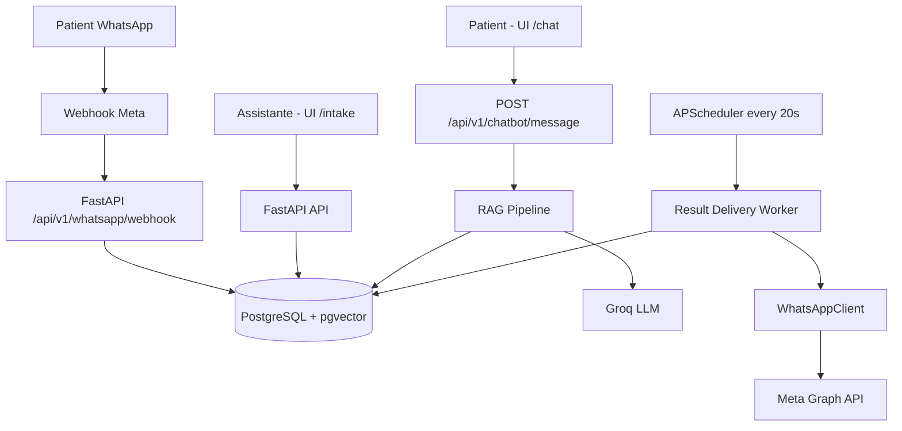

# Documentation Technique — PFF N°1

**Projet:** Assistant IA et automatisation WhatsApp pour un laboratoire d'analyses médicales  
**Version:** 1.0 (Sprint 4)  
**Date:** 2026-03-31

---

## 1) Vue d'ensemble de l'architecture

Le système suit une architecture full-stack en couches:

- **Frontend web** (React + TypeScript + TanStack Router + Tailwind)
- **Backend API** (FastAPI + SQLAlchemy async)
- **Moteurs IA** (extraction ordonnance + chatbot RAG)
- **Base de données** (PostgreSQL 16 + pgvector)
- **Intégration WhatsApp** (Meta Graph API + mode simulation)
- **Agent autonome** (APScheduler pour livraison automatique des résultats)



---

## 2) Composants techniques

### 2.1 Frontend

- `frontend-pff-lab/src/routes/intake.tsx` : bureau opérateur (Module 1 + Module 3)
- `frontend-pff-lab/src/routes/chat.tsx` : chatbot patient (Module 2)
- Routage généré via `frontend-pff-lab/src/routeTree.gen.ts` (`/`, `/about`, `/chat`, `/intake`)

### 2.2 Backend FastAPI

- Application: `fastapi_app/app/application.py`
- Préfixe API global: `/api/v1`
- Routeur principal: `fastapi_app/app/api/router.py`
- Modules exposés: `auth`, `intake`, `chatbot`, `results`, `catalog`, `health`

### 2.3 Worker autonome

- Scheduler: `fastapi_app/app/workers/scheduler.py`
- Tâche: `fastapi_app/app/workers/tasks/result_delivery.py`
- Fréquence: toutes les **20 secondes**
- Sécurité de livraison implémentée:
  - passage en `sending` avant l'envoi
  - `retry_count` + `MAX_DELIVERY_RETRIES=3`
  - état terminal `delivery_failed`
  - journalisation via `result_audit_logs`

### 2.4 Initialisation au démarrage

Dans `application.py` (lifespan):

1. bootstrap opérateur initial (si variables auth présentes)
2. init RAG (pgvector + seed des connaissances)
3. démarrage scheduler
4. fermeture scheduler + client HTTP WhatsApp au shutdown

---

## 3) Référence API (principaux endpoints)

> Base URL locale: `http://localhost:8000/api/v1`

### 3.1 Santé

| Méthode | Endpoint | Auth | Description |
|---|---|---|---|
| GET | `/health` | Non | Healthcheck backend |

### 3.2 Auth opérateur

| Méthode | Endpoint | Auth | Description |
|---|---|---|---|
| POST | `/auth/login` | Non | Connexion opérateur (access + refresh token) |
| POST | `/auth/refresh` | Non | Renouvellement token |
| GET | `/auth/me` | Oui | Profil opérateur courant |
| POST | `/auth/operators` | Oui (Admin) | Création d'un opérateur |

### 3.3 Intake WhatsApp (Module 1)

| Méthode | Endpoint | Auth | Description |
|---|---|---|---|
| GET | `/whatsapp/webhook` | Non | Handshake Meta webhook |
| POST | `/whatsapp/webhook` | Non | Ingestion message WhatsApp (signature HMAC vérifiée) |
| GET | `/conversations` | Oui | Liste conversations + filtres |
| GET | `/messages?conversation_id=` | Oui | Historique des messages |
| PATCH | `/conversations/{conversation_id}/workflow` | Oui | Mise à jour workflow conversation/demande |
| POST | `/conversations/{conversation_id}/messages/outgoing` | Oui | Enregistrer message sortant assistante |
| POST | `/conversations/{conversation_id}/close` | Oui | Clôturer conversation avec message final |
| GET | `/conversations/{conversation_id}/prescriptions` | Oui | Lister ordonnances détectées |
| POST | `/simulate/message` | Non (mode simulation) | Simuler message patient pour démo/tests |

### 3.4 Chatbot RAG (Module 2)

| Méthode | Endpoint | Auth | Description |
|---|---|---|---|
| POST | `/chatbot/message` | Non | Réponse IA hors horaires + RAG |

### 3.5 Catalogue & tarification

| Méthode | Endpoint | Auth | Description |
|---|---|---|---|
| GET | `/catalog` | Non | Catalogue des analyses |
| GET | `/pricing-rules` | Non | Règles de tarification par tier |

### 3.6 Résultats (Module 3)

| Méthode | Endpoint | Auth | Description |
|---|---|---|---|
| POST | `/results/conversations/{conversation_id}` | Oui | Upload résultat (URL PDF) |
| GET | `/results/conversations/{conversation_id}` | Oui | Lister résultats d'une conversation |
| PATCH | `/results/{result_id}/status` | Oui | Validation/rejet statut résultat |

---

## 4) Schéma base de données (ERD)

```mermaid
erDiagram
  PATIENTS ||--o{ CONVERSATIONS : has
  PATIENTS ||--o{ ANALYSIS_REQUESTS : has
  CONVERSATIONS ||--o{ MESSAGES : has
  CONVERSATIONS ||--o{ PRESCRIPTIONS : has
  CONVERSATIONS ||--|| ANALYSIS_REQUESTS : owns
  ANALYSIS_REQUESTS ||--|| LAB_RESULTS : produces
  LAB_RESULTS ||--o{ RESULT_AUDIT_LOGS : logs
  OPERATOR_USERS ||--o{ RESULT_AUDIT_LOGS : acts_on

  OPERATOR_USERS {
    uuid id PK
    string email UK
    string role
    bool is_active
    datetime last_login_at
  }

  PATIENTS {
    uuid id PK
    string full_name
    string phone_e164 UK
  }

  CONVERSATIONS {
    uuid id PK
    string whatsapp_chat_id UK
    uuid patient_id FK
    string status
    datetime last_message_at
  }

  MESSAGES {
    uuid id PK
    uuid conversation_id FK
    string direction
    string message_type
    string whatsapp_message_id UK
    text content_text
    text media_url
    datetime sent_at
  }

  PRESCRIPTIONS {
    uuid id PK
    uuid conversation_id FK
    uuid message_id FK UK
    string extraction_status
    jsonb extracted_payload
  }

  ANALYSIS_REQUESTS {
    uuid id PK
    uuid conversation_id FK UK
    uuid patient_id FK
    string status
    string pricing_tier
    text notes
  }

  LAB_RESULTS {
    uuid id PK
    uuid analysis_request_id FK UK
    text file_url
    string status
    int retry_count
    text operator_notes
  }

  RESULT_AUDIT_LOGS {
    uuid id PK
    uuid lab_result_id FK
    uuid operator_id FK
    string action
    text details
  }

  ANALYSIS_CATALOG {
    uuid id PK
    string code UK
    string name
    int coefficient
    jsonb synonyms
  }

  PRICING_RULES {
    uuid id PK
    string tier UK
    numeric multiplier
  }

  KNOWLEDGE_CHUNKS {
    uuid id PK
    text content
    string category
    vector embedding
  }
```

---

## 5) Explication du pipeline RAG

Pipeline principal: `fastapi_app/app/rag/pipelines/chatbot_rag.py`

### Étapes

1. **Encodage requête**
   - modèle embeddings `all-MiniLM-L6-v2`
2. **Retrieval vectoriel**
   - `query_similar(..., top_k=3)` via pgvector (distance cosinus)
3. **Construction prompt système**
   - contexte laboratoire (FR/Darija)
   - règles de sécurité (pas de diagnostic)
   - mention hors horaires si applicable
4. **Génération LLM**
   - appel Groq (`llama-3.3-70b-versatile`)
5. **Réponse API**
   - texte chatbot + `is_off_hours` + `sources`

### Alimentation des connaissances

Au démarrage (`application.py`):

- activation extension pgvector (`CREATE EXTENSION IF NOT EXISTS vector`)
- seed des chunks `LAB_KNOWLEDGE` (idempotent) dans `knowledge_chunks`

---

## 6) Setup technique (docker-compose + .env)

## 6.1 Backend

Depuis `fastapi_app`:

```bash
docker compose up -d
python -m pip install -e ".[dev]"
alembic upgrade head
python scripts/seed_real_world_data.py
python main.py
```

### Variables backend minimales (`fastapi_app/.env`)

- `DATABASE_URL` (ou défaut local postgres)
- `AUTH_SECRET_KEY` (>=32 chars recommandé)
- `AUTH_INITIAL_OPERATOR_EMAIL`
- `AUTH_INITIAL_OPERATOR_PASSWORD`
- `AUTH_INITIAL_OPERATOR_ROLE` (`admin`, `intake_manager`, `intake_operator`)
- `GROQ_API_KEY` (Module 2)
- `WHATSAPP_SIMULATION_MODE` (`true` recommandé en démo)
- `WHATSAPP_APP_SECRET`, `WHATSAPP_WEBHOOK_VERIFY_TOKEN` (si webhook réel)
- `WHATSAPP_ACCESS_TOKEN`, `WHATSAPP_PHONE_NUMBER_ID` (si envoi réel)

## 6.2 Frontend

Depuis `frontend-pff-lab`:

```bash
npm install
npm run dev
```

### Variables frontend (`frontend-pff-lab/.env`)

- `VITE_API_BASE_URL=http://localhost:8000`
- `VITE_SHOW_SIMULATION=false` (mettre `true` pour afficher le panneau de simulation)

## 6.3 Vérifications rapides

- Backend: `GET /api/v1/health` retourne `status=ok`
- Frontend: `/intake` connexion opérateur OK
- Build frontend: `npm run build`
- Lint frontend: `npm run lint`
- Tests backend: `python -m pytest tests/unit tests/integration -q`

---

## 7) Points d'architecture importants pour soutenance

- Webhook sécurisé (signature HMAC `X-Hub-Signature-256`)
- Workflow métier explicite (state transitions conversation + demande)
- Agent autonome avec garde-fous de livraison (SENDING/retries/dead-letter)
- RAG intégré PostgreSQL (pas de service vector DB externe)
- Séparation propre: routes → services → repositories → models

---

## 8) Limites assumées (hors scope PFF)

- Historique chatbot persistant côté serveur non implémenté
- Upload fichier résultat via URL (pas de stockage objet natif)
- APScheduler mono-instance (un vrai queue worker est préférable en prod multi-instance)
- Pas encore de tests frontend automatisés

Ces limites n'empêchent pas la couverture des exigences PFF.
